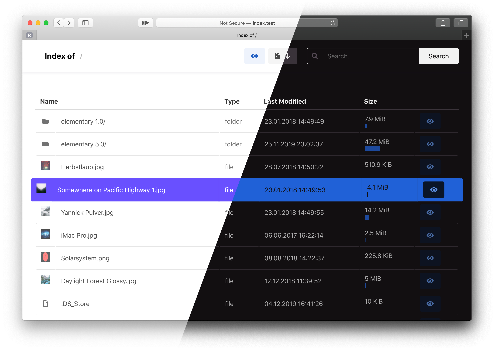

# TODO: write readme...

# Features:

- automatic light/dark mode
- easy file hide/show and deny/allow rules, using `.indexignore` files
- support for `README.md` parsing as directory previews (similar to githubs or gitlabs repositories)
- secure path resolving
- fast indexing using a cache with support for:
  - file -sizes and -hashes (md5, sha1, sha256)
  - image thumbnails
  - file- and directory-search with regex support
- download of directories as `.zip` files
- support for docker (-compose) as runtime

# Current State:

# Demo:
[files.ricwein.com](https://files.ricwein.com)
